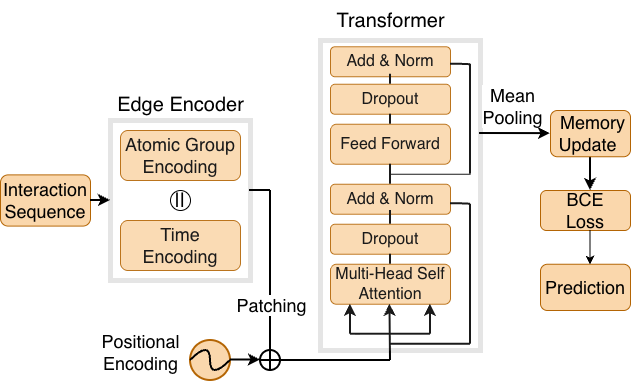

## DLP: Dual Link Prediction from Hydrogen Bonds in Dynamic Molecular Graph
We propose a novel dual link prediction framework (DLP) that predicts the coexistence of *dual links* from dynamic molecular graphs.



### Dependencies

The following libraries and frameworks are required to run the code. Make sure to install these dependencies using `pip` or `conda`.

- **torch**: PyTorch, a deep learning framework.
- **torch-geometric**: A library for graph neural networks.
- **torch_scatter**: Operations for sparse data.
- **torch_sparse**: Sparse matrix operations.
- **torch_cluster**: Clustering algorithms for graphs.
- **torch_spline_conv**: Spline-based convolution for graphs.
- **pybind11**: A library for creating Python bindings for C++ code.
- **torchmetrics**: Metrics for evaluating PyTorch models.
- **pandas**: Data manipulation and analysis library.
- **numpy**: Library for numerical computations.
- **scipy**: Library for scientific computing.


### How to use

#### Install libraries

```shell
pip install -r requirements.txt
```

#### Generate edge from time-stamped 3D coordinates of atoms

```shell
python gen_data.py --raw_data HB1000frames.csv
```

#### Compile C++ sampler 

```shell
python setup.py build_ext --inplace
```
#### Graph generation

```shell
python gen_graph.py --data FILT_HB/edges1.csv
python gen_graph.py --data FILT_HB/edges2.csv
```
#### Dual Link prediction

```shell
python train.py --data FILT_HB
```

#### Baselines

To run the adapted baselines go to the corresponding folder and run the following

```shell
bash run.sh
```


### Datasets

Presently, we only provide a small sample of the dataset used [Download Sample Dataset](https://drive.google.com/file/d/1cYsPavp3G7H16gU5ysX_ldmjD8uA7by-/view?usp=sharing). Since the data was obtained from our collaborators working on Molecular Dynamics Simulation at other institutions - please send us a formal request via email and we will promptly respond and provide it.

### Contact

If you have any questions, feel free to contact us.
Emails: `mhanowar@iastate.edu` or `gocet25@iastate.edu`

### License

This project is released under the MIT License. See `LICENSE` and
`THIRD_PARTY_LICENSES.md` for details.


