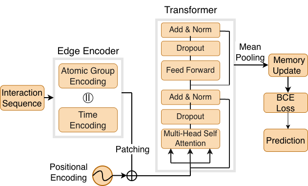
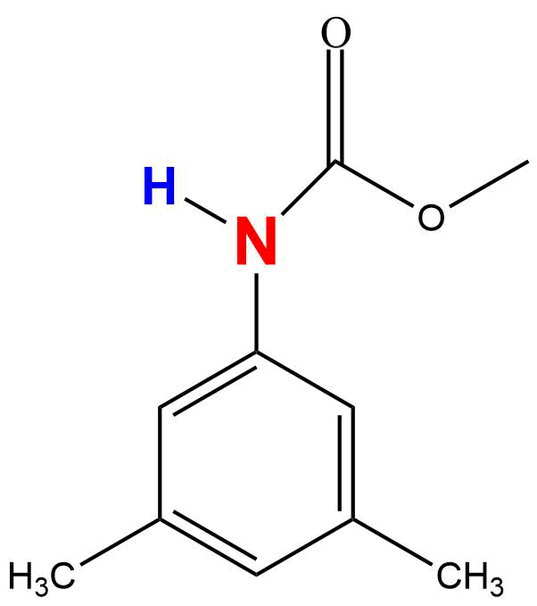
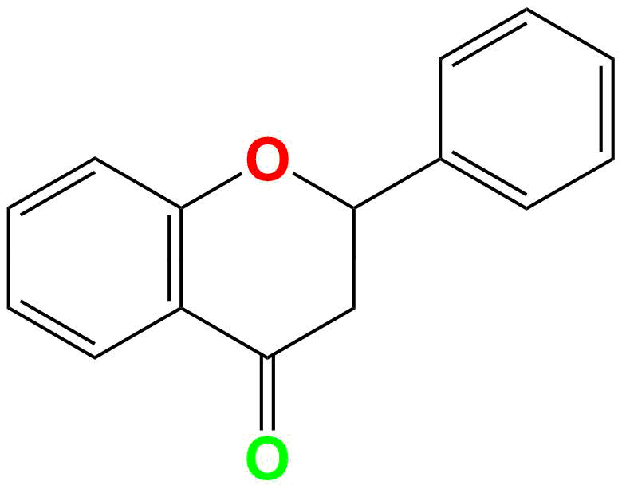

## DLP
This repository provides the source code for the implementation of the methods described in: **Hydrogen Bond Prediction With Spatio-Temporal Evolution Awareness** (NOTE: Submitted as an application paper at ACM SIGSPATIAL 2026).

In this work, we propose a novel link prediction framework (DLP) that predicts the coexistence of *dual links* from dynamic molecular graphs.



### Dependencies

The following libraries and frameworks are required to run the code. Make sure to install these dependencies using `pip` or `conda`.

- **torch**: PyTorch, a deep learning framework.
- **torch-geometric**: A library for graph neural networks.
- **torch_scatter**: Operations for sparse data.
- **torch_sparse**: Sparse matrix operations.
- **torch_cluster**: Clustering algorithms for graphs.
- **torch_spline_conv**: Spline-based convolution for graphs.
- **pybind11**: A library for creating Python bindings for C++ code.
- **torchmetrics**: Metrics for evaluating PyTorch models.
- **pandas**: Data manipulation and analysis library.
- **numpy**: Library for numerical computations.
- **scipy**: Library for scientific computing.


### How to use

#### Install libraries

```shell
pip install -r requirements.txt
```

#### Generate edge from time-stamped 3D coordinates of atoms

```shell
python gen_data.py --raw_data HB1000frames.csv
```

#### Compile C++ sampler

```shell
python setup.py build_ext --inplace
```
#### Graph generation

```shell
python gen_graph.py --data flavanone255k/edges1.csv
python gen_graph.py --data flavanone255k/edges2.csv
```
#### Dual Link prediction

```shell
python train.py --data flavanone255k
```

#### Baselines

To run the adapted baselines, go to the corresponding folder and run the following:

```shell
bash run.sh
```


### Datasets

Presently, we only provide a small sample of the dataset used: [Download Sample Dataset](https://drive.google.com/file/d/1cYsPavp3G7H16gU5ysX_ldmjD8uA7by-/view?usp=sharing). Since the data was obtained from our collaborators working on Molecular Dynamics Simulation at other institutions, please send us a formal request via email and we will promptly respond and provide it.


#### Data Preprocessing

The `gen_data.py` script converts raw molecular dynamics simulation trajectories into the two temporal edge streams used by DLP. The input is a per-frame record of atoms with their 3D coordinates `(x, y, z)`, `Atom Name`, `Atom Type`, `Molecule Name`, and `Molecule ID`. Each dataset contains a polymer substrate, ADMPC (Amylose Tris(3,5-dimethylphenyl carbamate)), and a drug molecule — Flavanone (*Flavanone255k*, *Flavanone80k*) or Benzoin (*Benzoin*).

<table align="center">
  <tr>
    <td align="center"></td>
    <td align="center"></td>
  </tr>
  <tr>
    <td align="center"><em>A repeating unit of the polymer (ADMPC).</em></td>
    <td align="center"><em>Example of a drug molecule (Flavanone).</em></td>
  </tr>
</table>

The pipeline keeps only HB-relevant atoms (donors, covalently bonded H atoms, and acceptors), normalizes timestamps to a common origin, and for each frame enumerates donor–hydrogen–acceptor triplets to build two edge types:

- **Distance edges** — created when the donor–acceptor distance is within 3.5 Å.
- **Angle edges** — created when the acceptor–H–donor angle is within [135°, 180°).

A node forming both edge types at the same timestamp is a **positive dual link** (`y=1`); nodes with only one edge type are **negatives** (`y=0`).

See Section 2.3 of the paper for the formal definitions and thresholds.

**Outputs:**

| File | Contents |
|------|----------|
| `edges1.csv` | distance-type edges `(source, destination, timestamp)` |
| `edges2.csv` | angle-type edges `(source, destination, timestamp)` |
| `node_features.pt` | molecule-level node attributes |

### Contact

If you have any questions, feel free to contact us.
Emails: `mhanowar@iastate.edu` or `gocet25@iastate.edu`

### License

This project is released under the MIT License. See `LICENSE` and `THIRD_PARTY_LICENSES.md` for details.
